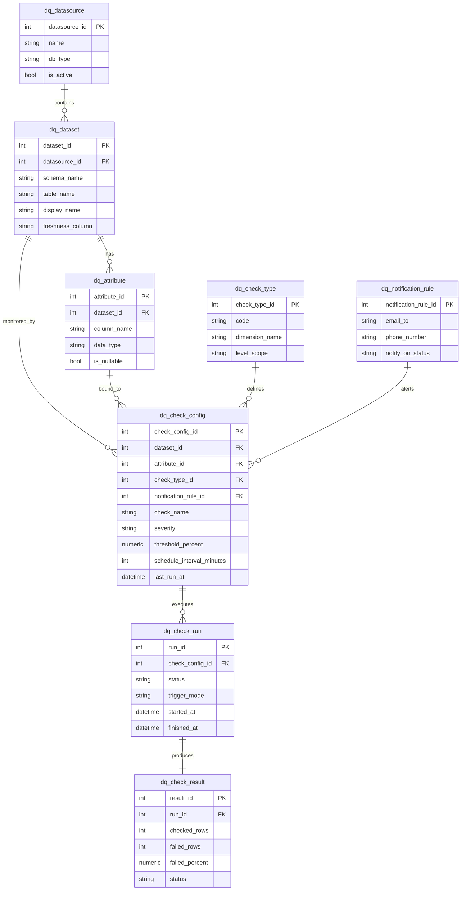

# ER-диаграмма сервиса DQ Monitoring

```mermaid
erDiagram
    dq_datasource ||--o{ dq_dataset : contains
    dq_dataset ||--o{ dq_attribute : has
    dq_dataset ||--o{ dq_check_config : monitored_by
    dq_attribute ||--o{ dq_check_config : bound_to
    dq_check_type ||--o{ dq_check_config : defines
    dq_notification_rule ||--o{ dq_check_config : alerts
    dq_check_config ||--o{ dq_check_run : executes
    dq_check_run ||--|| dq_check_result : produces

    dq_datasource {
      int datasource_id PK
      string name
      string db_type
      bool is_active
    }
    dq_dataset {
      int dataset_id PK
      int datasource_id FK
      string schema_name
      string table_name
      string display_name
      string freshness_column
    }
    dq_attribute {
      int attribute_id PK
      int dataset_id FK
      string column_name
      string data_type
      bool is_nullable
    }
    dq_check_type {
      int check_type_id PK
      string code
      string dimension_name
      string level_scope
    }
    dq_notification_rule {
      int notification_rule_id PK
      string email_to
      string phone_number
      string notify_on_status
    }
    dq_check_config {
      int check_config_id PK
      int dataset_id FK
      int attribute_id FK
      int check_type_id FK
      int notification_rule_id FK
      string check_name
      string severity
      numeric threshold_percent
      int schedule_interval_minutes
      datetime last_run_at
    }
    dq_check_run {
      int run_id PK
      int check_config_id FK
      string status
      string trigger_mode
      datetime started_at
      datetime finished_at
    }
    dq_check_result {
      int result_id PK
      int run_id FK
      int checked_rows
      int failed_rows
      numeric failed_percent
      string status
    }
```
